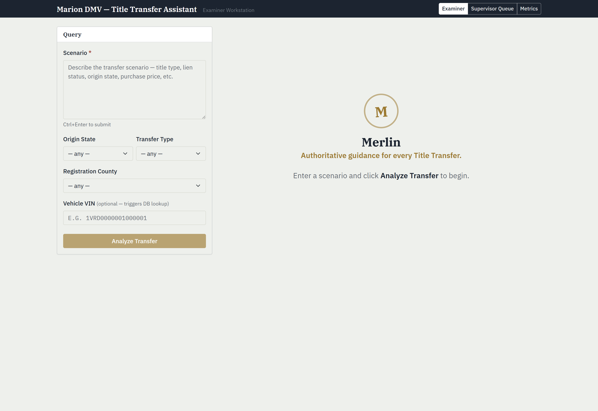
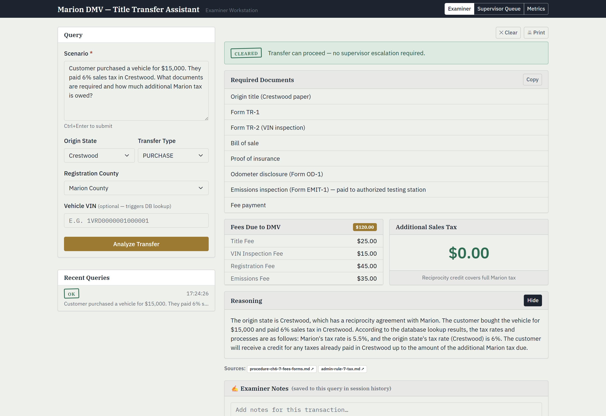
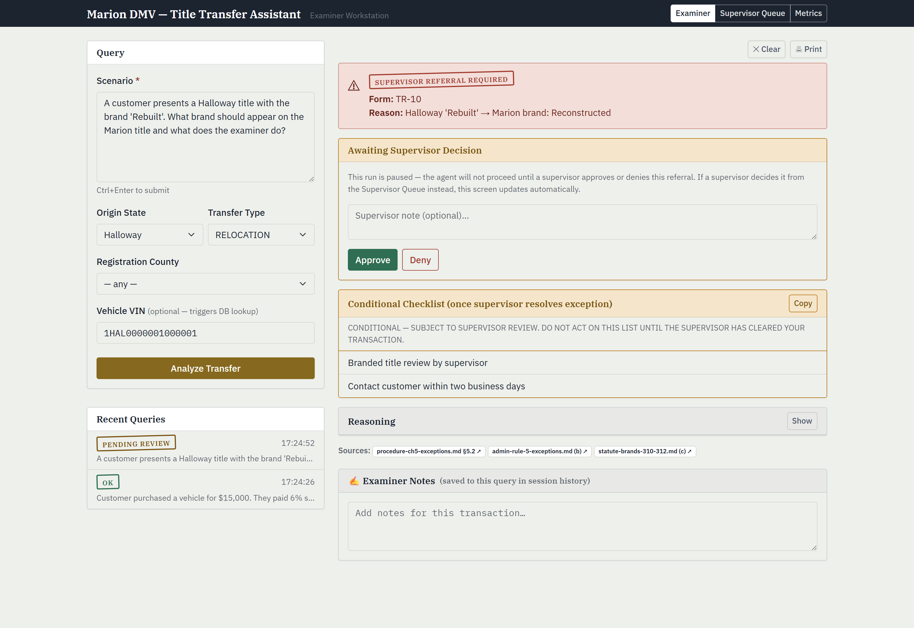
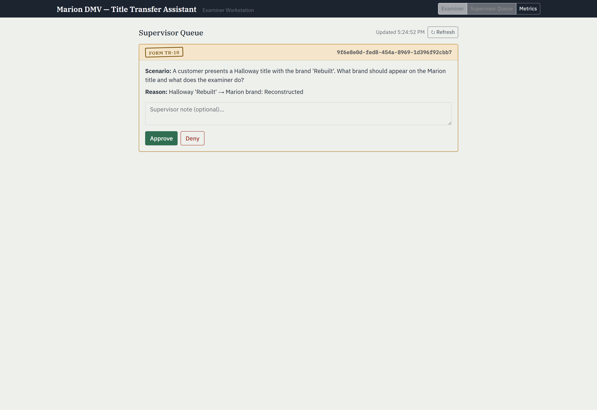
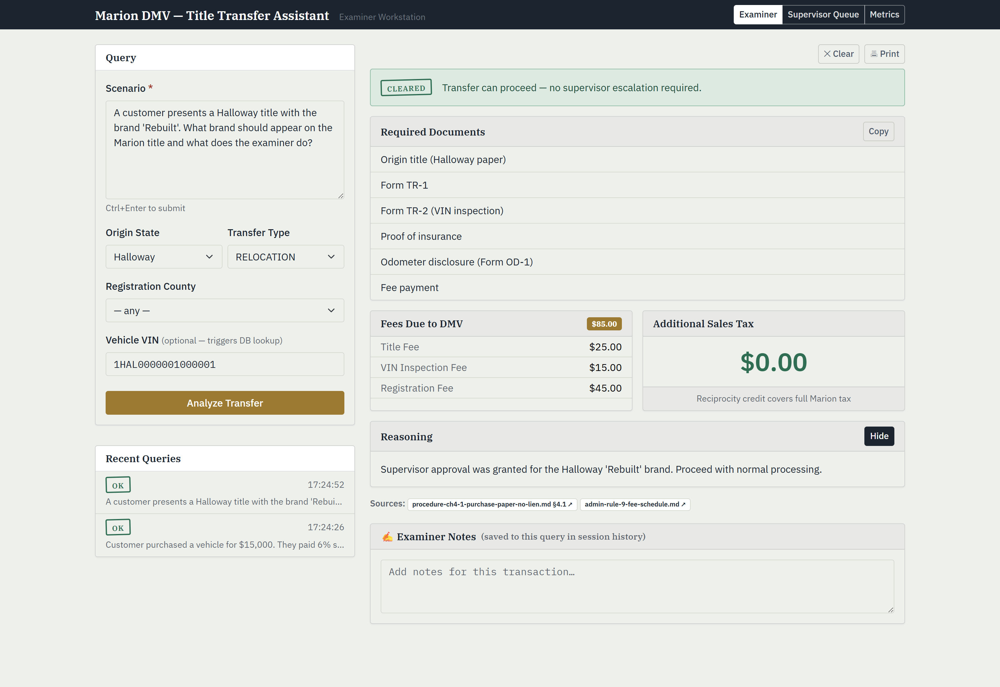
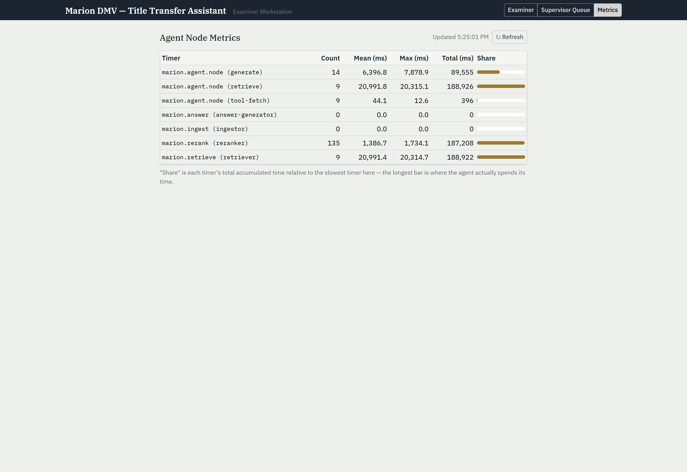

# Marion DMV — Application Walkthrough

What the app actually does, in screenshots. See `architecture.md` for the
system design and `running.md` to stand it up locally.

**Merlin** is an examiner-facing assistant for Marion County's out-of-state
title transfer desk. An examiner describes a transfer scenario in plain
language; the agent retrieves the relevant regulations, pulls live
vehicle/tax/fee data over MCP, and returns a checklist, fees, and tax owed —
or, if the scenario trips an exception (active lien, branded title,
unrecognized origin state), routes it to a human supervisor instead of
guessing.

---

## 1. Examiner workstation

The examiner fills in a free-text scenario plus a few structured fields
(origin state, transfer type, county, VIN). Origin State auto-detects from
the scenario text as you type — Marion recognizes four origin states
(Verdana, Crestwood, Halloway, Pembrook); anything else routes to a
supervisor by rule.

## 2. A clean transfer — computed, not guessed

Scenario: *"Customer purchased a vehicle for $15,000. They paid 6% sales tax
in Crestwood."* No lien, no brand, a recognized origin state — the agent
clears it directly:

- **Required Documents** — assembled per transfer type (PURCHASE here pulls
  in "Bill of sale"; RELOCATION would swap that for residency proof instead).
- **Fees Due to DMV** — itemized, not a single opaque total.
- **Additional Sales Tax** — $0.00 here because Marion's reciprocity credit
  with Crestwood (6% paid there) fully covers Marion's 5.5% tax. This
  arithmetic is **not** trusted to the LLM — `TransferResponseValidator`
  recomputes it deterministically from the itemized components server-side.
- **Sources** — every citation links back to the actual corpus document
  (`/api/corpus/...`), so an examiner can verify the regulation, not just
  trust the summary.

## 3. An exception — the agent stops and asks

Scenario: *"A customer presents a Halloway title with the brand 'Rebuilt'."*
A branded title is one of three hard stops (lien, brand, unrecognized
state). The agent:

1. Identifies the Marion-equivalent brand ("Halloway Rebuilt → Marion
   Reconstructed") from the Brand Equivalency Guide.
2. Populates a **conditional** checklist — items the customer will likely
   need, explicitly marked "DO NOT ACT ON THIS LIST UNTIL THE SUPERVISOR HAS
   CLEARED YOUR TRANSACTION."
3. **Pauses the run** at a LangGraph4j checkpoint (`await_supervisor`) and
   returns control to the browser — the graph does not proceed until a
   supervisor decides. This is a real pause (`MemorySaver` + `interruptBefore`),
   not just a UI flag on top of a completed answer.

## 4. Supervisor Queue — discoverable independent of the examiner's tab

A supervisor doesn't need the examiner's browser session or the `threadId`
handed to them — `GET /api/transfer/pending-referrals` scans every thread
the checkpoint store has ever seen and returns the ones still parked at the
gate node. This view polls independently and works from a second browser
entirely, which is how it's meant to be used: examiner and supervisor are
different people.

## 5. Approve resumes the graph *and* re-invokes the model

Clicking Approve doesn't just unblock the UI — it merges the supervisor's
decision (and optional note) into graph state and resumes execution, which
falls through to a **second GENERATE pass**. The model reruns with the
supervisor's ruling in context and produces a genuinely new response: the
conditional checklist is folded into the real one, fees and tax are
computed, and the reasoning explicitly reflects the approval ("Supervisor
approval was granted for the Halloway 'Rebuilt' brand..."). A Deny follows
the same path but keeps the transfer blocked and records the supervisor's
stated reason instead — see `test-scenarios.md` Group G for both cases
verified against live LLM-call counts, not just response text.

The examiner's own tab doesn't need to be the one that decides — it polls
`GET /api/transfer/query/agent/{threadId}` every 4s and picks up the
resolution automatically if a *different* session (e.g. the Supervisor
Queue) resolves it first, which is exactly what happened for this
screenshot.

## 6. Metrics — instrumented, not guessed at

Every graph node is wrapped in a Micrometer `Timer`. This isn't decorative —
it's how the two-pass HITL behavior above was actually verified: `generate`
COUNT increases by exactly one per supervisor resume, confirming a real
second LLM call happened rather than a cached/templated unblock. It also
answers "where does the agent spend its time" directly (`retrieve` and
`rerank` dominate here, not `generate`) instead of leaving it to guesswork.

---

## What this doesn't cover

This walkthrough shows the happy path and the referral path once. It
doesn't show: the Deny decision, PII detection on the input form, print
view, or the Examiner Notes/history sidebar in depth. `test-scenarios.md`
has curl-level detail for all of those.
