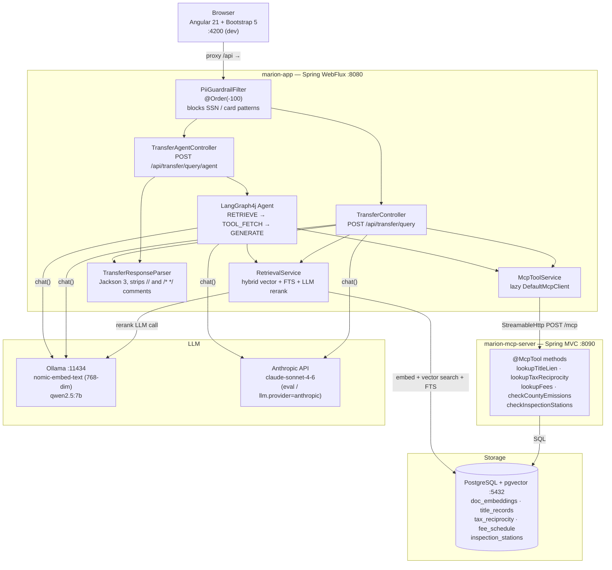
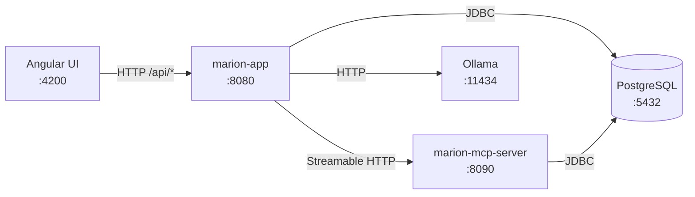
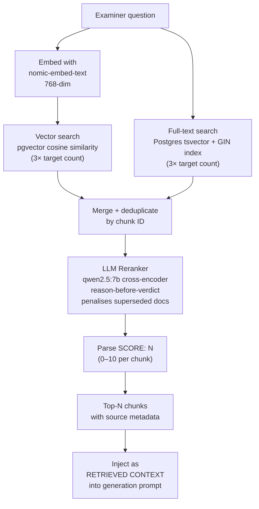
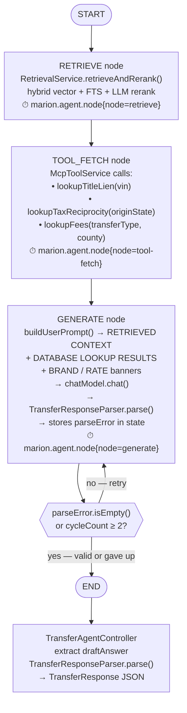
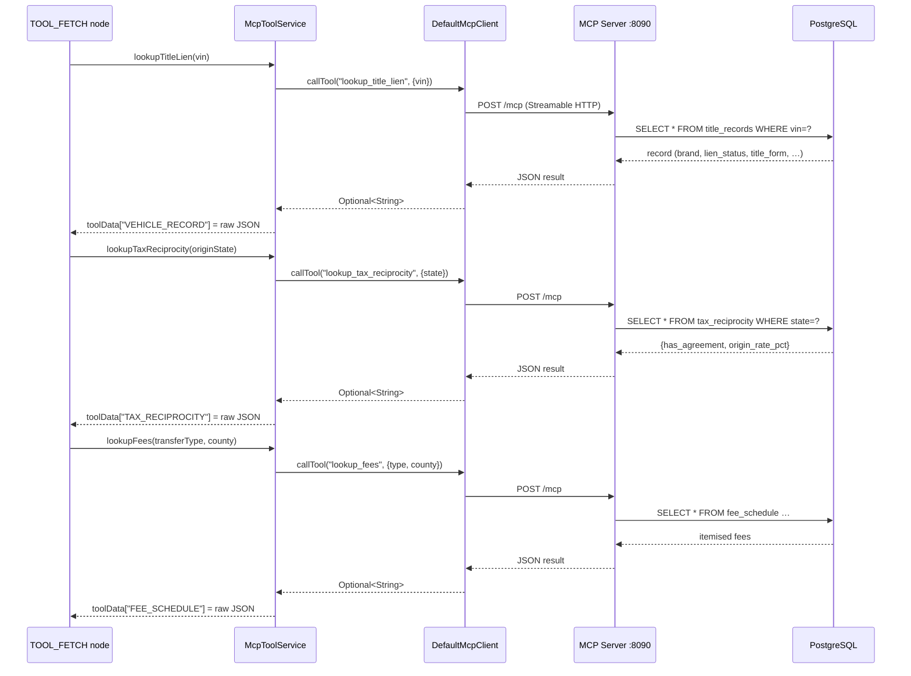
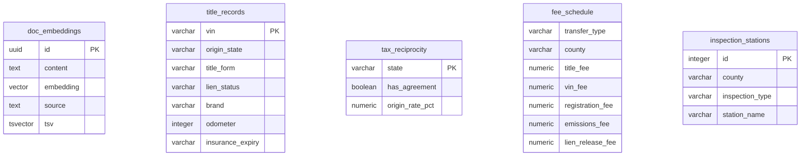

# Marion DMV — System Architecture

## System Overview



## Component Roles

| Component | Role |
|---|---|
| `PiiGuardrailFilter` | WebFlux `WebFilter` at `@Order(-100)`; regex-blocks SSN and card patterns on `/api/transfer/**`; returns 400 before the request reaches any controller |
| `TransferController` | Single-shot endpoint; retrieval + MCP tools + LLM in one blocking `Mono.fromCallable`; retries once on parse failure with specific Jackson error in prompt |
| `TransferAgentController` | Delegates to the compiled LangGraph4j graph; returns parsed `TransferResponse` |
| `TransferAgentGraph` | Defines RETRIEVE → TOOL_FETCH → GENERATE graph with conditional retry edge; each node timed via `marion.agent.node` Micrometer metric |
| `RetrievalService` | Hybrid retrieval: vector cosine + Postgres FTS; retrieves 3× target, reranks with LLM cross-encoder (reason-before-verdict, `SCORE:` pattern), returns top-N |
| `McpToolService` | Lazy `DefaultMcpClient` with double-checked locking; degrades gracefully if MCP server is unreachable |
| `TransferResponseParser` | Strips `//` and `/* */` comments from raw LLM output, extracts first `{…}` block, deserializes with Jackson 3 `FAIL_ON_UNKNOWN_PROPERTIES=false` |
| `GlobalExceptionHandler` | `@RestControllerAdvice`; IAE → 422 `PARSE_FAILED`, ISE → 500 `AGENT_ERROR` |
| MCP server tools | Five `@McpTool` methods backed by PostgreSQL; auto-registered by Spring AI 2.0 |

## Ports and Dependencies



## HTTP Endpoints

| Method | Path | Handler | Returns |
|---|---|---|---|
| `POST` | `/api/transfer/query` | `TransferController` | `TransferResponse` (JSON, 200) |
| `POST` | `/api/transfer/query/agent` | `TransferAgentController` | `TransferResponse` (JSON, 200) |
| `POST` | `/api/ingest/reset?confirm=true` | `IngestController` | wipes + reseeds corpus |
| `GET` | `/actuator/health` | Spring Boot Actuator | health status |
| `GET` | `/actuator/metrics/marion.agent.node` | Micrometer | node latency by tag |

---

# RAG Pipeline



### Reranker prompt design

The reranker receives each candidate chunk with the original question and must reason in prose before emitting a score on its final line (`SCORE: N`). Scores are parsed with `Pattern.compile("SCORE:\\s*(\\d+)")`. Unparseable output yields −1 (chunk dropped). Superseded documents (marked in their footer) are penalised by 4+ points to prevent stale rules from outranking current ones.

---

# LangGraph4j Agent Flow



### Retry mechanics

- `cycleCount` starts at 0 and increments each GENERATE pass.
- After a failed parse the retry prompt prepends `[RETRY N] Your previous response could not be parsed. Error: <Jackson message>`.
- At `cycleCount ≥ 2` the graph exits regardless of parse state; the controller then calls `parse()` one final time, which throws `IllegalArgumentException` if the output is still malformed — caught by `GlobalExceptionHandler` → 422.
- `recursionLimit(10)` is a backstop (3 nodes × 2 cycles + retrieve + tool_fetch = 8 steps).

---

# MCP Tool Integration



### Prompt injection after tool fetch

Once tool data is assembled, `buildUserPrompt` injects two banners if the data contains them:

- **Brand banner** — if `"brand": "Rebuilt"` appears in `VEHICLE_RECORD`, injects `*** BRAND STAMP DETECTED … supervisorReferral=true REQUIRED ***` so STEP 1 fires reliably even when the model would otherwise miss a JSON field.
- **Rate banner** — if `"origin_rate_pct": 4.50` appears in `TAX_RECIPROCITY`, injects `*** ORIGIN TAX RATE (from database): 4.5% — use THIS rate exactly ***` to prevent the model from hallucinating a different rate.

---

# Data Model (PostgreSQL)



---

# Prompt Architecture

The generation prompt is built in two layers:

**System prompt (static):**
- STEP 1: Brand/lien scan with explicit trigger words, scanning caution for data fields vs brand fields, Marion equivalency instruction
- STEP 2: Tax formula (4 explicit steps with worked examples A/B/C), emissions age formula with examples, superseded-rule rejection, database-is-authoritative rule
- Output schema: exact JSON shape with field-by-field instructions for referral vs normal path

**User prompt (dynamic, per request):**
```
RETRIEVED CONTEXT:
--- [1] source.md ---
<chunk text>

DATABASE LOOKUP RESULTS (authoritative):
VEHICLE_RECORD: {"vin":…,"brand":"Rebuilt",…}
TAX_RECIPROCITY: {"has_agreement":true,"origin_rate_pct":4.50}
FEE_SCHEDULE: {…}

*** BRAND STAMP DETECTED IN VEHICLE RECORD: "Rebuilt" — supervisorReferral=true REQUIRED ***
*** ORIGIN TAX RATE (from database): 4.5% — use THIS rate exactly ***

VEHICLE VIN: 1HAL0000001000001
ORIGIN STATE: Halloway
REGISTRATION COUNTY: Marion County
TRANSFER TYPE: PURCHASE

QUESTION: <examiner question>

[RETRY 1] Your previous response could not be parsed. Error: <Jackson message>   ← only on retry
```
