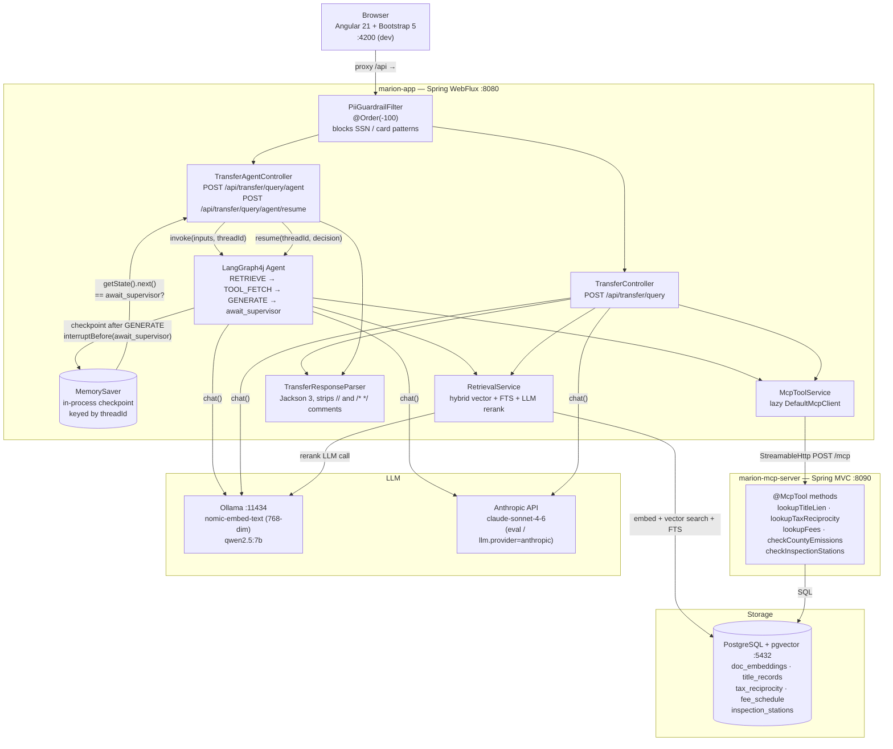
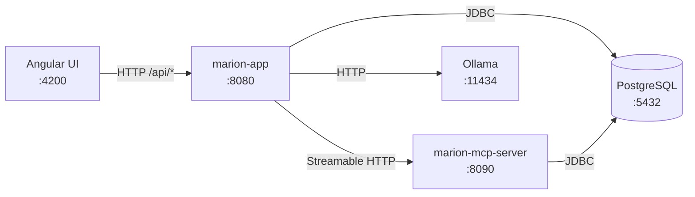
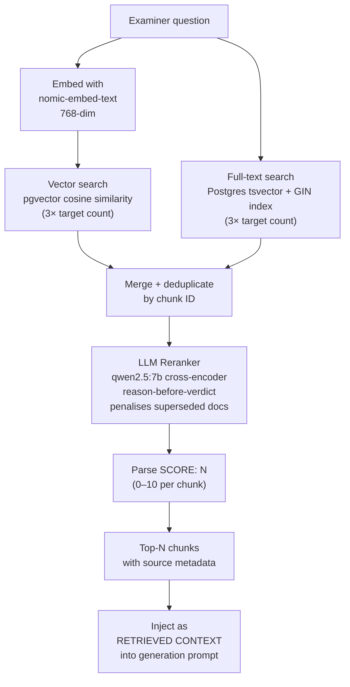
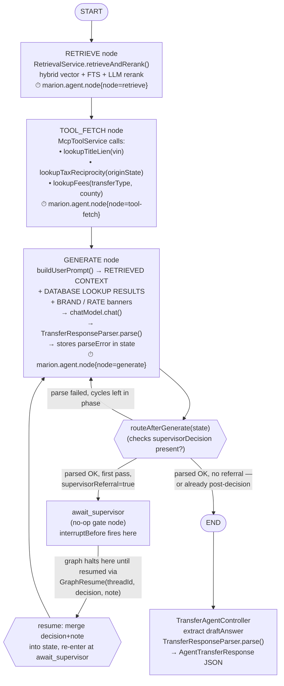
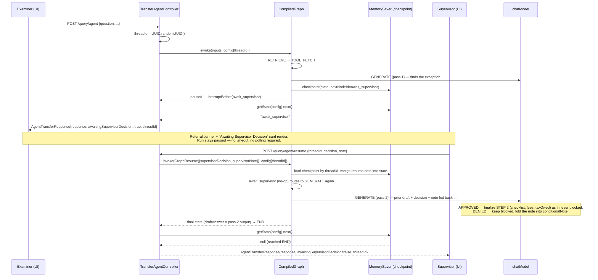
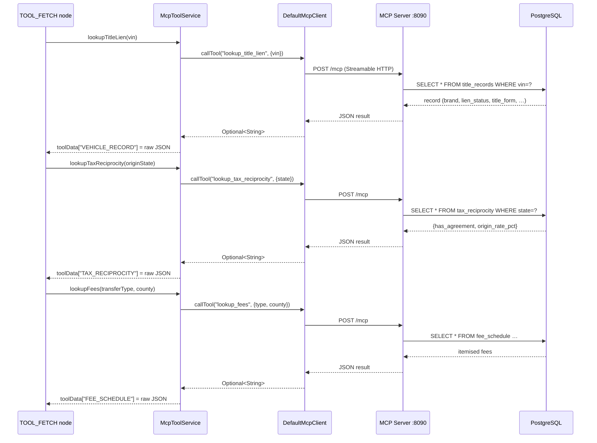
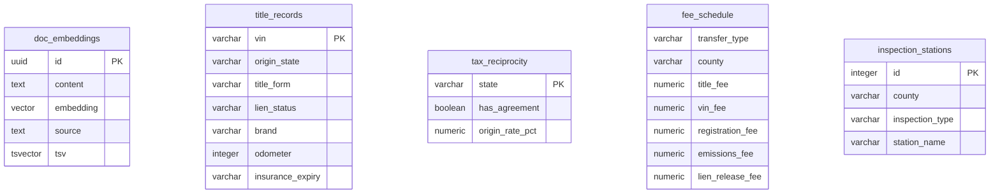

# Marion DMV — System Architecture

## System Overview



## Component Roles

| Component | Role |
|---|---|
| `PiiGuardrailFilter` | WebFlux `WebFilter` at `@Order(-100)`; regex-blocks SSN and card patterns on `/api/transfer/**`; returns 400 before the request reaches any controller |
| `TransferController` | Single-shot endpoint; retrieval + MCP tools + LLM in one blocking `Mono.fromCallable`; retries once on parse failure with specific Jackson error in prompt |
| `TransferAgentController` | Delegates to the compiled LangGraph4j graph; issues a fresh `threadId` per `/query/agent` call; returns `AgentTransferResponse` (wraps `TransferResponse` + `awaitingSupervisorDecision` + `threadId`); `/query/agent/resume` re-enters a paused checkpoint by `threadId` |
| `TransferAgentGraph` | Defines RETRIEVE → TOOL_FETCH → GENERATE → `await_supervisor` graph with a conditional retry edge and a conditional referral-pause edge; each node timed via `marion.agent.node` Micrometer metric |
| `await_supervisor` node | No-op gate node; its only purpose is a named `interruptBefore()` target. The graph halts here — after GENERATE's output is committed, before this node's body runs — whenever `supervisorReferral=true` |
| `MemorySaver` | LangGraph4j in-process `BaseCheckpointSaver`; persists graph state keyed by `threadId` so a paused run can be resumed later in the same process. **Not durable across app restarts** — a real deployment needs a Postgres-backed saver (not shipped by LangGraph4j) |
| `RetrievalService` | Hybrid retrieval: vector cosine + Postgres FTS; retrieves 3× target, reranks with LLM cross-encoder (reason-before-verdict, `SCORE:` pattern), returns top-N |
| `McpToolService` | Lazy `DefaultMcpClient` with double-checked locking; degrades gracefully if MCP server is unreachable |
| `TransferResponseParser` | Strips `//` and `/* */` comments from raw LLM output, extracts first `{…}` block, deserializes with Jackson 3 `FAIL_ON_UNKNOWN_PROPERTIES=false` |
| `GlobalExceptionHandler` | `@RestControllerAdvice`; IAE → 422 `PARSE_FAILED`, ISE → 500 `AGENT_ERROR` |
| MCP server tools | Five `@McpTool` methods backed by PostgreSQL; auto-registered by Spring AI 2.0 |

## Ports and Dependencies



## HTTP Endpoints

| Method | Path | Handler | Returns |
|---|---|---|---|
| `POST` | `/api/transfer/query` | `TransferController` | `TransferResponse` (JSON, 200) |
| `POST` | `/api/transfer/query/agent` | `TransferAgentController` | `AgentTransferResponse` (JSON, 200) — `{response, awaitingSupervisorDecision, threadId}` |
| `POST` | `/api/transfer/query/agent/resume` | `TransferAgentController` | `AgentTransferResponse` (JSON, 200) — resumes a paused `threadId` with `{decision, note}`; does not re-invoke the LLM |
| `POST` | `/api/transfer/stream` | `TransferController` | SSE phase/token/result events (non-agent path; no checkpointing, so no HITL pause) |
| `POST` | `/api/ingest/reset?confirm=true` | `IngestController` | wipes + reseeds corpus |
| `GET` | `/actuator/health` | Spring Boot Actuator | health status |
| `GET` | `/actuator/metrics/marion.agent.node` | Micrometer | node latency by tag |

---

# RAG Pipeline



### Reranker prompt design

The reranker receives each candidate chunk with the original question and must reason in prose before emitting a score on its final line (`SCORE: N`). Scores are parsed with `Pattern.compile("SCORE:\\s*(\\d+)")`. Unparseable output yields −1 (chunk dropped). Superseded documents (marked in their footer) are penalised by 4+ points to prevent stale rules from outranking current ones.

---

# LangGraph4j Agent Flow



### Retry mechanics

- `cycleCount` starts at 0 and increments each GENERATE pass, shared across both the first pass and
  the post-supervisor-decision pass (it is never reset).
- After a failed parse the retry prompt prepends `[RETRY N] Your previous response could not be parsed. Error: <Jackson message>` — independent of, and additive with, the supervisor-review block (see below), so a parse-retry mid post-review pass doesn't lose the decision context.
- `routeAfterGenerate` caps retries at `FIRST_PASS_MAX_CYCLES=2` for the first pass, or
  `FIRST_PASS_MAX_CYCLES + POST_REVIEW_MAX_CYCLES=4` total once `supervisorDecision` is present in
  state — and once present, the edge never routes back to `await_supervisor`, only to `generate` or `end`.
- `recursionLimit(14)` is a generous backstop, not a tight budget: retrieve + tool_fetch + up to 4
  generate cycles (across both phases) + await_supervisor + end.
- Retry and referral-pause are mutually exclusive per cycle: `routeAfterGenerate` only checks `supervisorReferral` once parsing has already succeeded, so a malformed response is always retried before referral status is ever consulted.

---

# Human-in-the-Loop Supervisor Review

Real pause/resume, not a display-only flag: when GENERATE produces `supervisorReferral=true`, the graph
execution itself halts before advancing past `await_supervisor`, and stays halted — potentially indefinitely —
until a supervisor's decision arrives on a separate HTTP call. On resume, the decision and note are **fed
back to the model** — `await_supervisor` routes to a second GENERATE pass (not straight to END), so the
agent produces a genuinely finalized response rather than just unblocking the original draft.



### Design notes

- **Detecting a pause is checkpoint-driven, not stream-driven.** `graph.invoke()` returns the graph's state
  either way; the only reliable signal for "did this pause or finish?" is `graph.getState(config).next()`,
  which reads the persisted `Checkpoint.nextNodeId` — it equals `"await_supervisor"` when paused, `null`
  when the run reached `END`.
- **Resume triggers exactly one more GENERATE pass, never a re-pause.** `routeAfterGenerate` checks
  `state.supervisorDecision().isPresent()`: once a decision has been merged into state (which only happens
  via resume), the graph will never route back to `await_supervisor` again, no matter what the second
  pass's own `supervisorReferral` value comes out as. Retry-on-parse-failure still applies within each
  phase (`FIRST_PASS_MAX_CYCLES` + `POST_REVIEW_MAX_CYCLES`, both = 2 — `recursionLimit(14)` is a generous
  backstop, not a tight budget).
- **The second pass gets the first pass's full draft, not just the decision.** `buildSupervisorReviewBlock()`
  includes the prior `draftAnswer` verbatim plus the decision/note, and instructs the model explicitly:
  APPROVED → run STEP 2 to completion (fold `conditionalChecklist` into `checklist`, compute fees/tax,
  clear `supervisorReferral`); DENIED → stay blocked, explain the denial in `conditionalNote`. This block is
  appended *after* the original STEP 1 trigger banners in the prompt and explicitly says it supersedes them
  — otherwise a weaker model can re-trigger STEP 1 from the earlier banner instead of honoring the decision.
- **`threadId` is the resume key.** It's generated per `/query/agent` call, returned to the client in
  `AgentTransferResponse`, and must be echoed back verbatim on `/query/agent/resume`. There is no
  server-side list of pending referrals in this prototype — the client (UI history entry) is the only
  place `threadId` is retained.
- **`MemorySaver` is in-process memory, not a durable store.** A paused referral is lost if `marion-app`
  restarts before a supervisor decides. Acceptable for a prototype; a production deployment needs a
  Postgres-backed `BaseCheckpointSaver` (LangGraph4j ships the interface, not an implementation).
- **The non-agent path (`/api/transfer/stream`, `TransferController`) has no checkpointer and cannot pause.**
  HITL only exists on the LangGraph4j-backed `/query/agent` path — this is why the UI's `submit()` uses that
  endpoint rather than the SSE streaming one.

---

# MCP Tool Integration



### Prompt injection after tool fetch

Once tool data is assembled, `buildUserPrompt` injects two banners if the data contains them:

- **Brand banner** — if `"brand": "Rebuilt"` appears in `VEHICLE_RECORD`, injects `*** BRAND STAMP DETECTED … supervisorReferral=true REQUIRED ***` so STEP 1 fires reliably even when the model would otherwise miss a JSON field.
- **Rate banner** — if `"origin_rate_pct": 4.50` appears in `TAX_RECIPROCITY`, injects `*** ORIGIN TAX RATE (from database): 4.5% — use THIS rate exactly ***` to prevent the model from hallucinating a different rate.

---

# Data Model (PostgreSQL)



---

# Prompt Architecture

The generation prompt is built in two layers:

**System prompt (static):**
- STEP 1: Brand/lien scan with explicit trigger words, scanning caution for data fields vs brand fields, Marion equivalency instruction
- STEP 2: Tax formula (4 explicit steps with worked examples A/B/C), emissions age formula with examples, superseded-rule rejection, database-is-authoritative rule
- Output schema: exact JSON shape with field-by-field instructions for referral vs normal path

**User prompt (dynamic, per request):**
```
RETRIEVED CONTEXT:
--- [1] source.md ---
<chunk text>

DATABASE LOOKUP RESULTS (authoritative):
VEHICLE_RECORD: {"vin":…,"brand":"Rebuilt",…}
TAX_RECIPROCITY: {"has_agreement":true,"origin_rate_pct":4.50}
FEE_SCHEDULE: {…}

*** BRAND STAMP DETECTED IN VEHICLE RECORD: "Rebuilt" — supervisorReferral=true REQUIRED ***
*** ORIGIN TAX RATE (from database): 4.5% — use THIS rate exactly ***

VEHICLE VIN: 1HAL0000001000001
ORIGIN STATE: Halloway
REGISTRATION COUNTY: Marion County
TRANSFER TYPE: PURCHASE

QUESTION: <examiner question>

[RETRY 1] Your previous response could not be parsed. Error: <Jackson message>   ← only on retry
```
